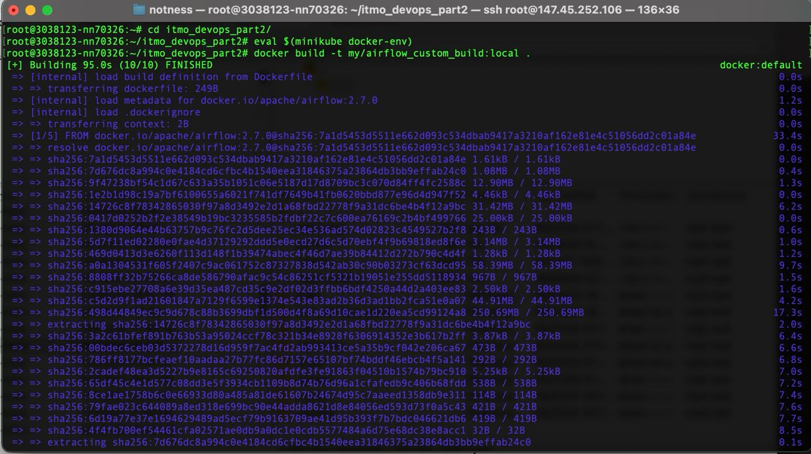
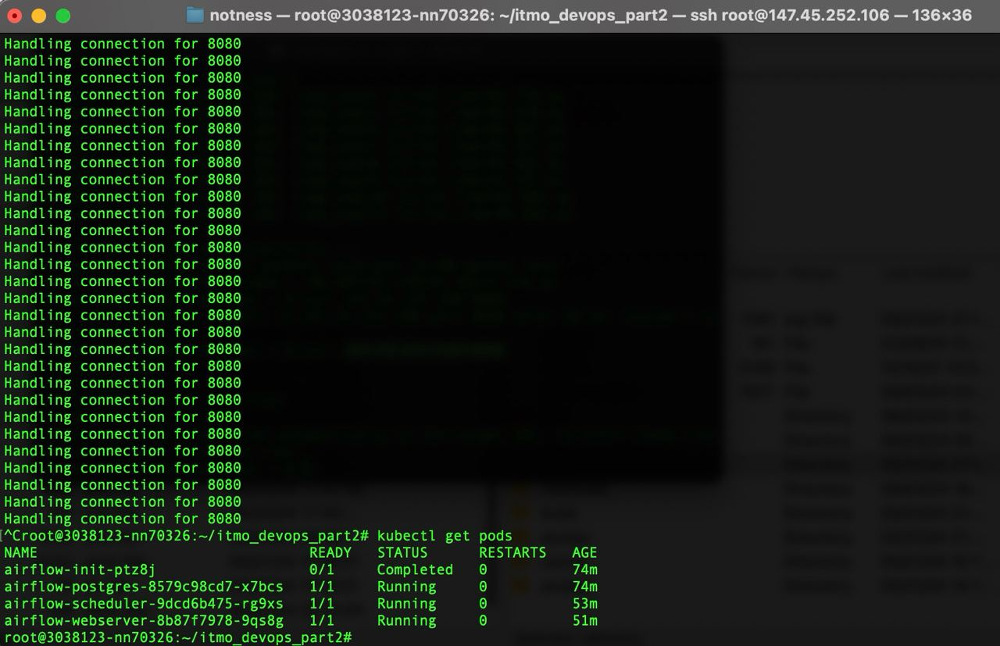
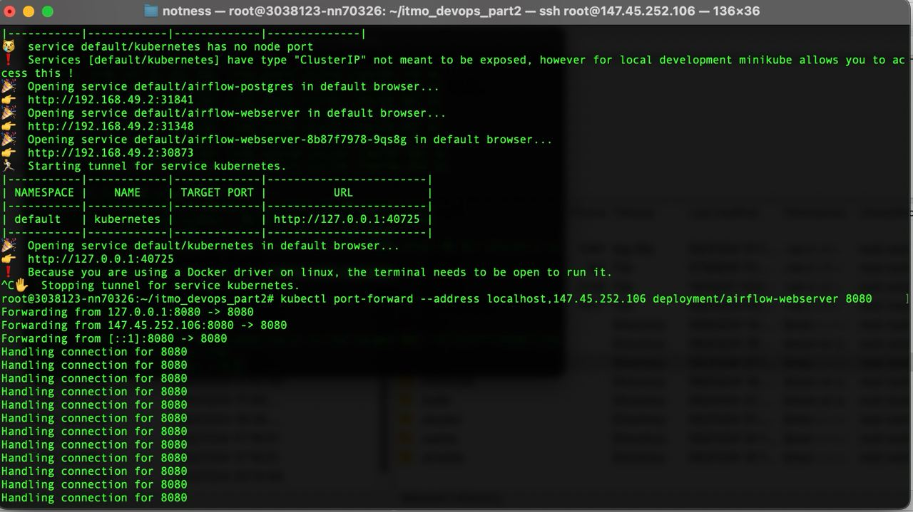
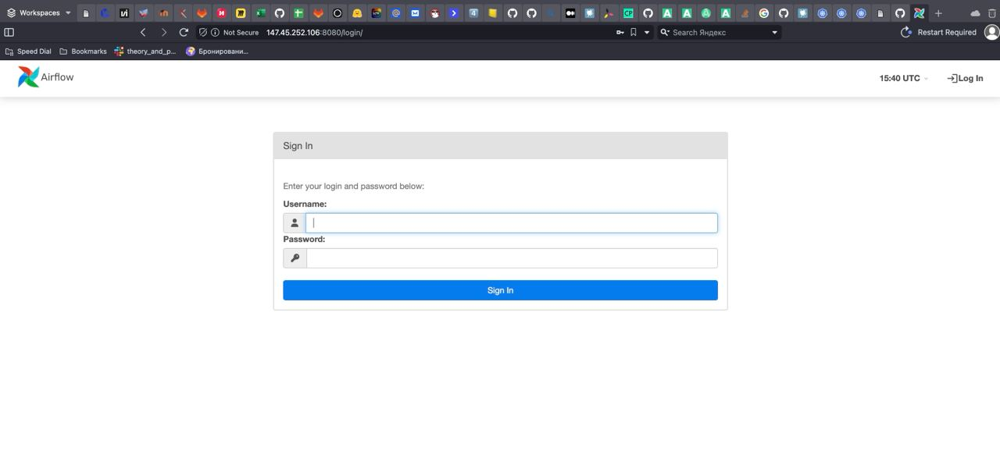

# itmo_devops_part2
Репозиторий для загрузки домашних заданий по курсу "Контейнеризация и оркестрация приложений". 

Состав команды: Воляница Елизавета, Фёдорова Инесса

12.05.2023 - ЛР 1. Airflow + Dockerfile

18.05.2023 - ЛР 2. Docker-compose

25.05.2023 - ЛР 3. Kubernetes

03.06.2023 - ЛР 4. More Kubernetes

## Ход работы

### Шаг 0 - Запускаем minikube

```
minikube start --force
```

### Шаг 1 - Собираем кастомный докер в minikube

```
eval $(minikube docker-env)
docker build -t my/airflow_custom_build:local .
```



### Шаг 2 - Добавляем манифесты

```
kubectl create -f postgres_configmap.yml
kubectl create -f postgres_secret.yml
kubectl create -f airflow_configmap.yml
kubectl create -f airflow_secret.yml
kubectl create -f airflow_postgres.yml
kubectl create -f airflow_init.yml
kubectl create -f airflow_scheduler.yml
kubectl create -f airflow_webserver.yml
```



### Шаг 3 - Запускаем на remote хосте, поэтому прокидываем порты

```
kubectl port-forward --address localhost,147.45.252.106 deployment/airflow-webserver 8080
```



### Шаг 4 - Проверяем сервис

