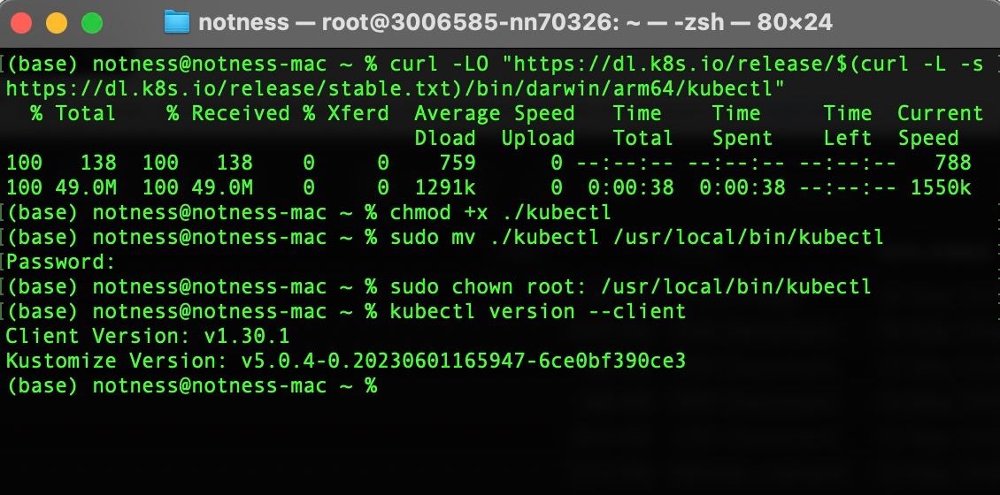
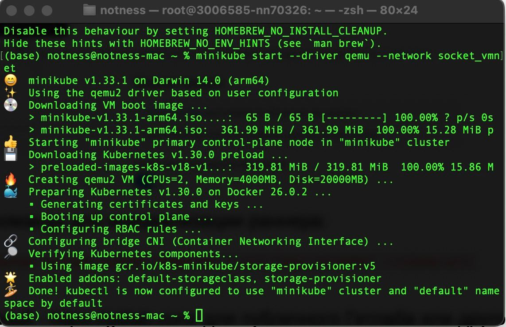
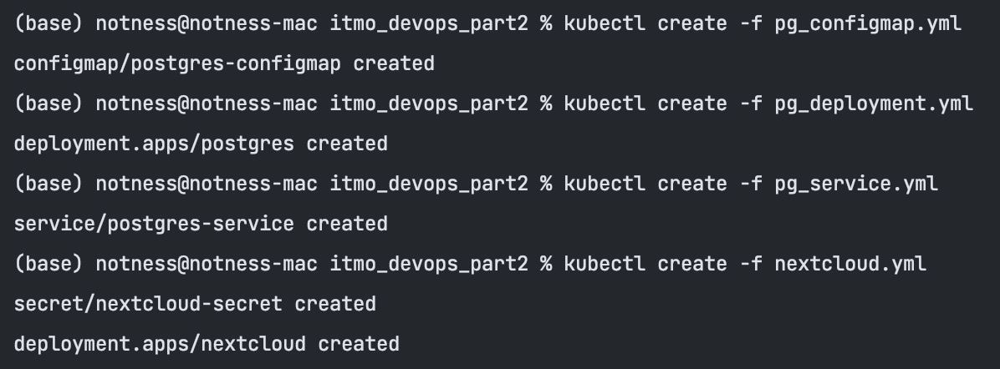
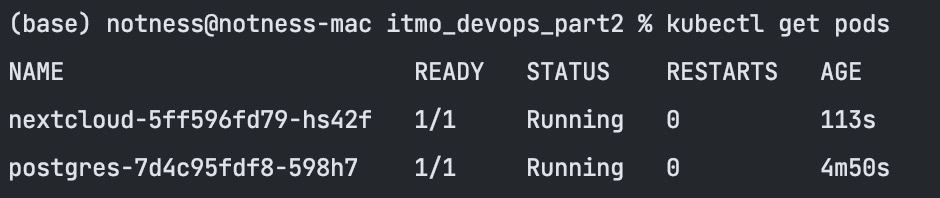
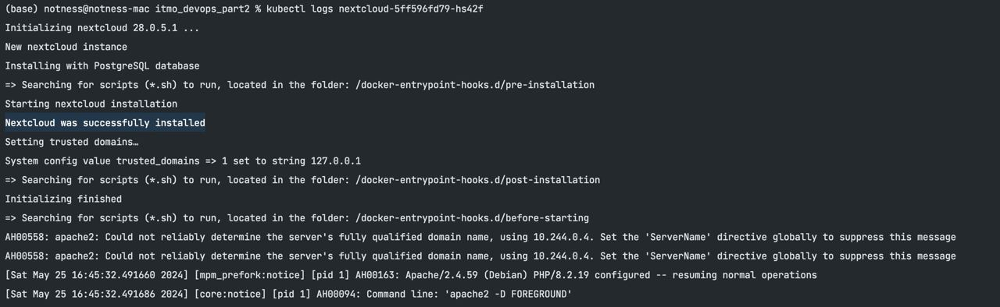
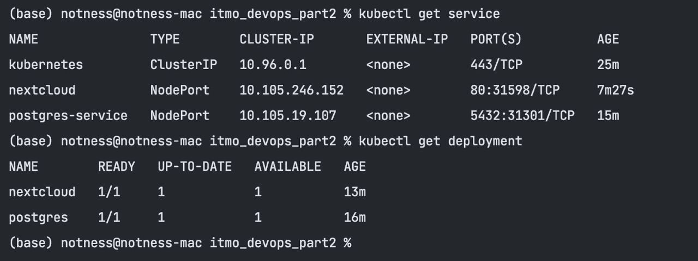
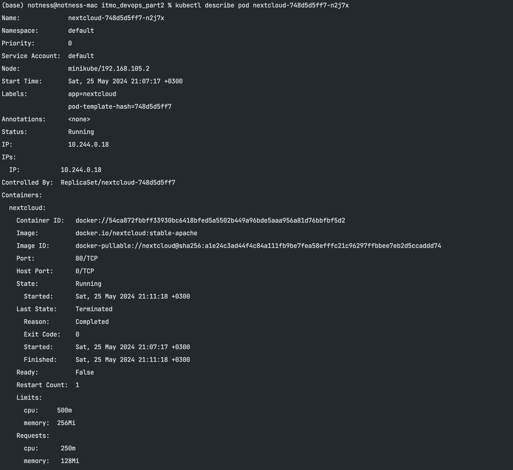
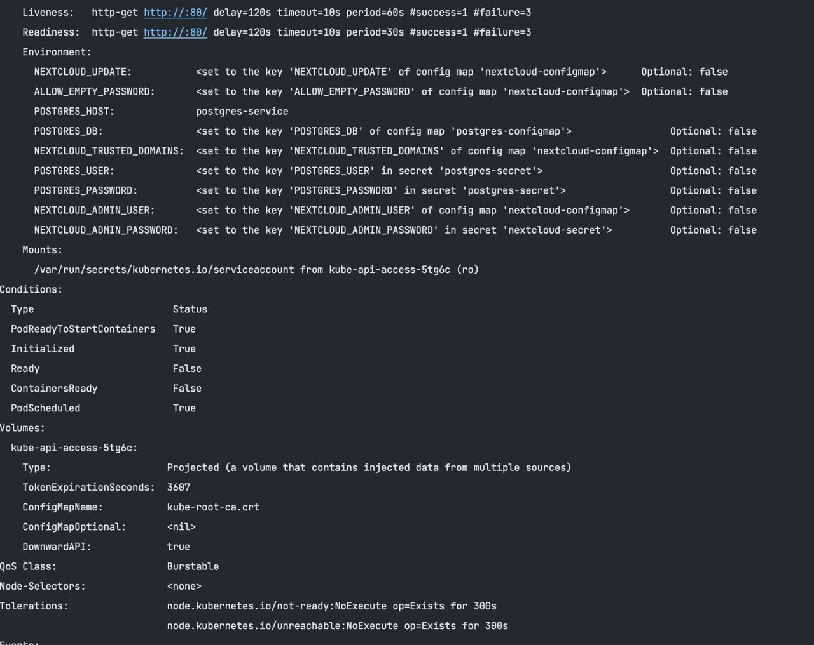

# itmo_devops_part2
Репозиторий для загрузки домашних заданий по курсу "Контейнеризация и оркестрация приложений". 

Состав команды: Воляница Елизавета, Фёдорова Инесса

12.05.2023 - ЛР 1. Airflow + Dockerfile

18.05.2023 - ЛР 2. Docker-compose

25.05.2023 - ЛР 3. Kubernetes


## Запуск проекта

- [ ] Собрать и запустить проект можно с помощью команд: 
```
kubectl create -f pg_configmap.yml
kubectl create -f pg_secret.yml
kubectl create -f pg_service.yml
kubectl create -f pg_deployment.yml
kubectl create -f nextcloud.yml
```


## Задача
Осуществить махинации над манифестами из примера, чтоб получить следующее:

- Для постгреса перенести `POSTGRES_USER` и `POSTGRES_PASSWORD` из конфигмапы в секреты (очевидно, понадобится новый манифест для сущности Secret)
- Для некстклауда перенести его переменные (`NEXTCLOUD_UPDATE`, `ALLOW_EMPTY_PASSWORD` и проч.) из деплоймента в конфигмапу (очевидно, понадобится новый манифест для сущности ConfigMap)
- Для некстклауда добавить `Liveness` и `Readiness` пробы

### Описание выполнения

#### Шаг 1: Установка kubectl и minikube


**Note:** Для установки на macos с процессором m1 предварительно бало необходимо установить гипервизор `Qemu`



#### Шаг 2: Запуск nextcloud с дефолтными параметрами

**Создаем манифесты**



**Проверяем запущенные поды**



**Проверяем логи nextcloud**



**Проверяем запущенные сервисы**



#### Шаг 3: Добавление проб и обновление мест хранения переменных

**Были добавлены `Liveness` и `Readiness` пробы для nextcloud, креды postgres перенесены в секрет, переменные nexcloud перенесены в configmag. Обновлены и добавлены необходимые манифесты, результат на скриншотах ниже.**






### Вопросы
1. Важен ли порядок выполнения этих манифестов? Почему?
- Частично важен для зависимых друг от друга манифестов. При отсутствии конфигов и/или секретов, на которые ссылается деплоймент, он запустится с ошибкой. Но после добавления остальных манифестов деплоймент успешно рестартнет.
2. UPDATE: Что (и почему) произойдет, если отскейлить количество реплик postgres-deployment в 0, затем обратно в 1, после чего попробовать снова зайти на Nextcloud? 
- При скейле в 0 указанный под удаляется, следовательно, при удалении пода с базой nextcloud будет постоянно выдавать ошибку соединения с базой. После установки реплик в 1 для postgres, так как мы в манифесте не примонтировали volume, все данные postgres будут утеряны (при первоначальном удалении пода). То есть, после скейла postgres обратно в 1 при попытке авторизации nextcloud выдаст 500, то есть авторизация не будет корректно работать из-за отсутствующих данных базы.
